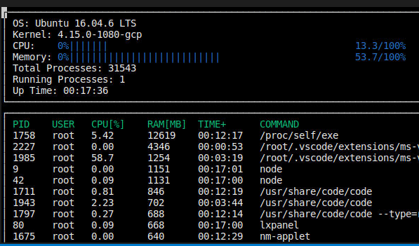

# C++ Nanodegree System Monitor

The project in this repository is result of the second project of the [Udacity C++ Nanodegree Program](https://www.udacity.com/course/c-plus-plus-nanodegree--nd213). The goal was to create a system monitor for the Linux Operating System similar to hptop with the objective of testing and practicing what was taught at the Object Oriented Programming (OOP) course of the program.

# CppND-System-Monitor Starter Code

Udacity provides a starter code that can be found at: https://github.com/udacity/CppND-System-Monitor-Project-Updated.git.
If you would like to try this project out by yourself, have a look at Udacity's own website and/or starter code repository. In case you would like to verify my solution works, and modify it, please feel free to continue reading and follow the instructions.

## Make
This project uses [Make](https://www.gnu.org/software/make/). The Makefile has four targets:
* `build` compiles the source code and generates an executable
* `format` applies [ClangFormat](https://clang.llvm.org/docs/ClangFormat.html) to style the source code
* `debug` compiles the source code and generates an executable, including debugging symbols
* `clean` deletes the `build/` directory, including all of the build artifacts

## Instructions

1. First, make sure you have installed [ncurses](https://www.gnu.org/software/ncurses/), which is a library that facilitates text-based graphical output in the terminal. This project relies on ncurses for display output. You can install ncurses within your own Linux environment: `sudo apt install libncurses5-dev libncursesw5-dev`

2. Clone the project repository: `git clone https://github.com/TheodoroCardoso/simpler-htop-cpp.git`

3. Build the project: `make build`

4. Run the resulting executable: `./build/monitor`
